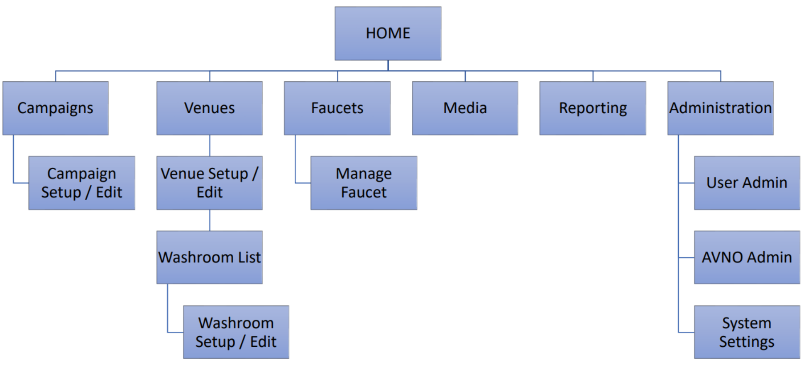

# Venue CMS

## Versions used for this project
1) `Python==3.8.10`
2) `Django==4.1.1`
3) `djangorestframework==3.13.1`

## How to install Venue CMS locally
1) Get the app from [GitHub repository](https://github.com/Quitiweb/venue_cms/) or unzip it from the file sent via email
2) From `venue_cms` folder, run `make install` (creates a virtual env)
3) Run `make init_database` (creates the database and admin superuser)
4) Run `make start_django_server` (starts the backend server)

## FlowChart

## Pending points

- [x] HTML template for `Views/GET` Campaigns, Venues, Faucets, etc.
- [x] Add `New` button
- [x] Create `Add new record` template
- [x] `Add` views and forms
- [x] Add `Actions` column
- [x] Deletes
- [x] Edits
- [x] HTML template for EDITs (or maybe one for each)
- [x] EDIT Forms
- [x] Administration section
- [ ] Notifications: saving, updating and deleting
- [ ] Notifications: Are you sure do you want to Delete?
- [x] Error messages: required fields
- [x] Error message in Venues related to Phone number!
- [x] error / info / warning messages

### ADMIN
- [x] SuperUser or AvnoUser
- [x] if SuperUser then: you can see Admin buttons
- [x] elif AvnoUser then: you don't see Admin
- [x] Only SuperUsers can create users
- [x] Filter Models by AvnoUser
- [x] User Admin & AVNO Admin sections in sidebar
- [ ] Password field - Fix
- [ ] Add New record when No Avno user = Owner field

### HOME OBJECTS
- [x] `Campaign.media` es una relación ManyToMany con `Media`
- [x] `Media.Type`: Video or Photo
- [x] Add Owner field to `MEDIA` model
- [x] `Venues.playlist` is an integer field with a `len(Campaigns.objects.all())`
- [x] `Washrooms.gender`: Male, Female, Family
- [x] Add `Washrooms` to sidebar

### VISUAL NOTES
- [X] Blue colour instead of purple (same as the login in the doc)
- [ ] Choose dates from Calendar
- [ ] Plus icon button for add new records (like Carlos design)
- [ ] True | False (Green | Red) - Give it some format in table

### OTHER
- [ ] Mount the API using `ngrok`

### Pending points after develop the API with Carlos
- [ ] `Faucets.playlist` from `Campaign.media`
- [ ] `Faucets.Status` - Online / Offline

## Dev Notes
- Material Dashboard revamp:
    - `apps.home.config.py` (I've deleted this. It looks that it works right)
- Replaced Purple: #9124a3 by Blue: #064cbd (background buttons and cards)